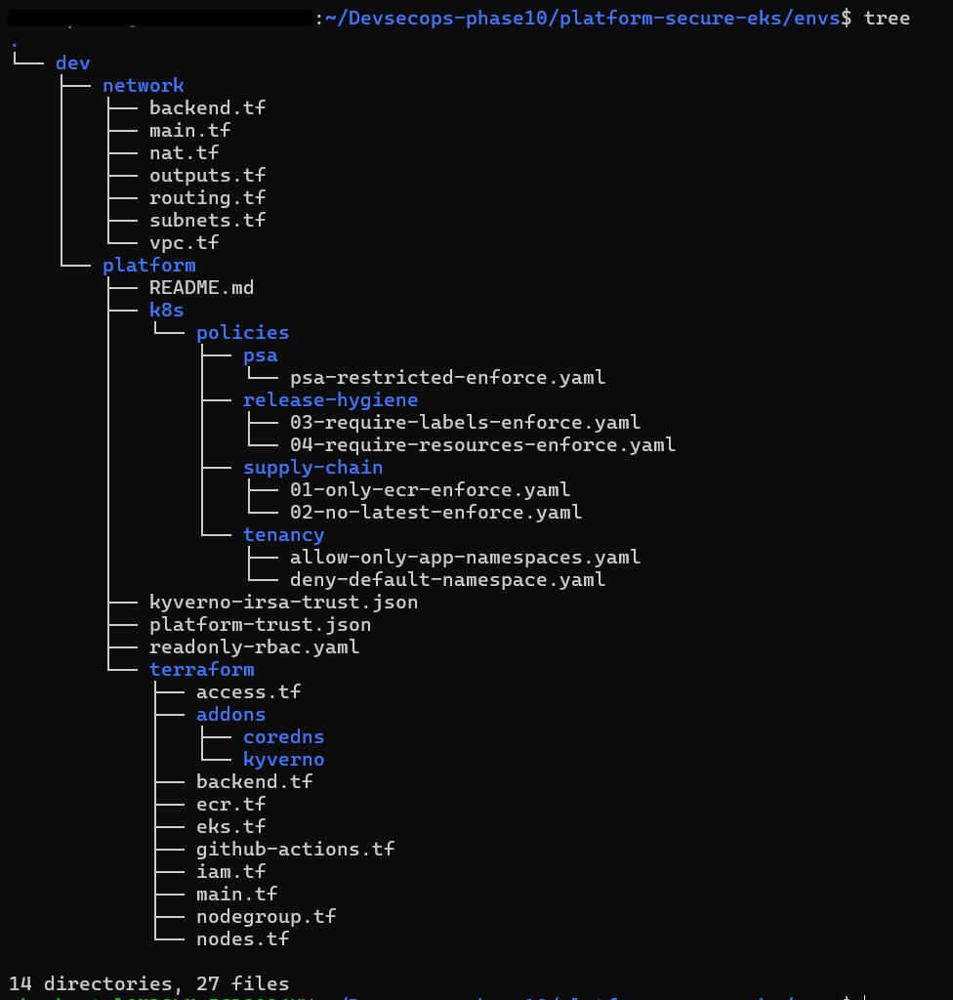

# # Cloud-Native Kubernetes Platform Governance (AWS EKS)

This repository defines a **governed Kubernetes platform on AWS**, built on Amazon EKS.

The platform applies controls at admission, separates identity across runtime, CI, and human access, and keeps sensitive actions auditable.

It represents a **reference platform baseline**, not a demo environment.

---

## Platform Architecture

##

##

This platform is designed as an **AWS-native governance baseline** for Kubernetes workloads.

It enforces control boundaries at four layers:
- **Cloud identity (AWS IAM)**
- **Cluster admission (Kyverno + PSA)**
- **Workload identity (IRSA)**
- **Infrastructure lifecycle (Terraform + OIDC)**

The diagram highlights how identities, policies, and infrastructure are deliberately separated to prevent privilege bleed across layers.

---

## AWS Control Plane Integration

This platform relies on AWS-native primitives rather than custom control planes.

- **IAM** defines trust boundaries between humans, CI systems, and workloads
- **EKS** provides the managed control plane while governance is enforced at admission
- **ECR** acts as the only trusted image source
- **CloudTrail** records all sensitive identity transitions
- **CloudWatch** raises alerts for break-glass activity

No static credentials are stored in the cluster or CI system.  
All access is identity-based and time-bound.

---

## What the Platform Covers

The platform defines a **supported workload path**.  
Workloads that fall outside this path are filtered at admission.

### Admission Controls (Kyverno)

Controls are applied **before scheduling**.

**Tenancy**
- Workloads are not allowed in the `default` namespace
- Only approved application namespaces are accepted

**Supply Chain**
- Images are pulled only from Amazon ECR
- Mutable tags (for example `latest`) are not accepted
- Images are referenced by digest

**Pod Security**
- Kubernetes PSA `restricted` is applied cluster-wide
- Privileged containers and root execution are not allowed

**Release Hygiene**
- CPU and memory requests and limits are required
- Standard labels (`app`, `env`, `owner`) are required on workloads

The result is a small, well-defined workload shape that the platform accepts.

---

## Validation

The platform was exercised using a set of test workloads applied directly to the cluster.

Observed behavior:
- workload in default namespace → filtered
- non-ECR image → filtered
- mutable tag → filtered
- missing resources or labels → filtered
- compliant workload → admitted

Test manifests:

Evidence:
- [Deny default namespace](docs/screenshots/k8s/01-k8s-deny-default-ns-deny.png)
- [Deny non-ECR image](docs/screenshots/k8s/02-k8s-deny-non-ecr-image-deny.png)
- [Deny mutable image tags](docs/screenshots/k8s/03-k8s-deny-latest-tag-deny.png)
- [Require resource limits](docs/screenshots/k8s/04-k8s-require-resources-deny.png)
- [Allow compliant workload](docs/screenshots/k8s/05-k8s-allow-compliant-workload-allow.png)

---

## Workload Identity (IRSA)

Application workloads use **IRSA** for AWS access.

- Pods run with a dedicated Kubernetes ServiceAccount
- AWS identity is assumed using OIDC
- Credentials are short-lived and scoped to the workload

Actions outside the role scope return `AccessDenied`, which was verified during testing.

Evidence:
- [IRSA identity assumed](docs/screenshots/aws/06-aws-irsa-identity-success.png)
- [IRSA access denied outside scope](docs/screenshots/aws/07-aws-irsa-access-denied.png)

---

## CI/CD Identity (GitHub Actions OIDC)

CI workflows authenticate to AWS using **GitHub Actions OIDC**.

- No static AWS credentials are stored in the repository
- Each workflow assumes a dedicated IAM role
- CI identity is isolated from workload and human access

Terraform plans for the platform run using this identity.

Evidence:
- [No static AWS credentials in CI](docs/screenshots/gha/08-gha-no-static-aws-keys.png)
- [OIDC role assumed by workflow](docs/screenshots/gha/09-gha-oidc-role-assume.png)
- [AWS identity in CI job](docs/screenshots/gha/10-gha-aws-identity.png)

---

## Break-Glass Access and Audit

A dedicated break-glass role exists for recovery scenarios.

- The role is not used during normal operation
- Assumption is a manual, audited action
- Usage is visible through CloudTrail events

CloudTrail logs are retained in an encrypted S3 bucket, and alerts are generated when the break-glass role is assumed.

Evidence:
- [Break-glass role exists](docs/screenshots/aws/11-breakglass-role-exists.png)
- [Not part of default access paths](docs/screenshots/aws/12-breakglass-not-default.png)
- [Break-glass role assumed](docs/screenshots/aws/13-breakglass-assumed.png)
- [Privileged action performed](docs/screenshots/aws/14-breakglass-privileged-action.png)
- [CloudTrail event recorded](docs/screenshots/aws/15-cloudtrail-breakglass-assumerole.png)

---

## Infrastructure Scope

The platform includes:
- VPC with private networking
- EKS cluster and managed node groups
- IAM roles for platform operations, CI/CD, workloads (IRSA), and break-glass access
- Kyverno installed as a cluster add-on

Infrastructure code is organized under:

---

## Terraform State and Trust Boundaries

Terraform state is intentionally **partitioned by responsibility**.

- **Network state** is isolated from platform state
- **Platform state** does not include application workloads
- CI pipelines assume scoped IAM roles using OIDC to access state

This separation ensures:
- Network changes cannot be made by application pipelines
- Platform operators cannot modify workload identities by default
- Break-glass access does not overlap with CI or runtime roles

State is stored remotely and protected using AWS-native controls.

---

## Status

- Platform validated against a live AWS EKS cluster
- Evidence captured during validation
- Cluster destroyed after validation
